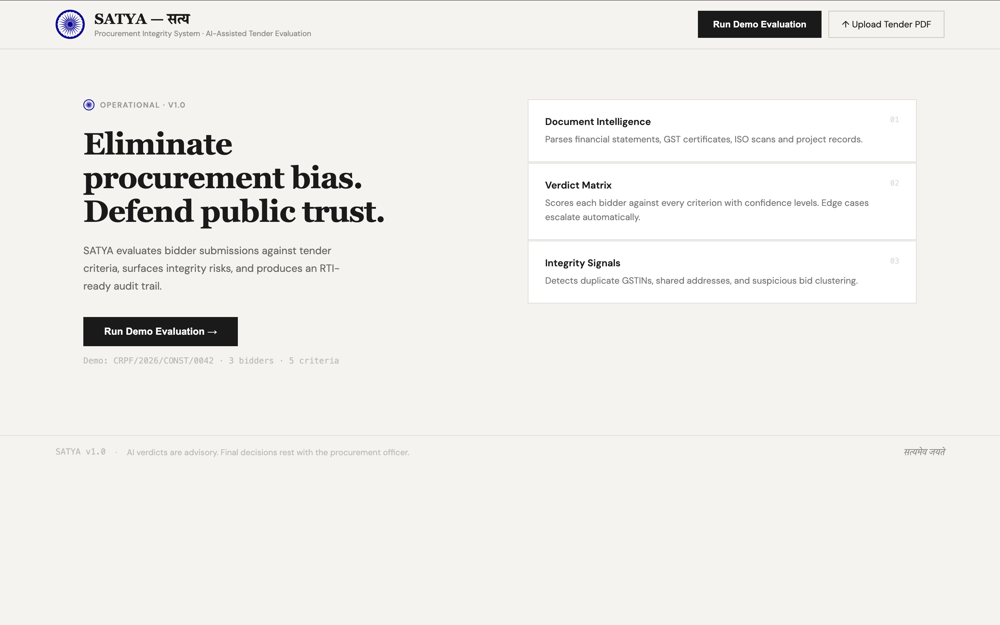
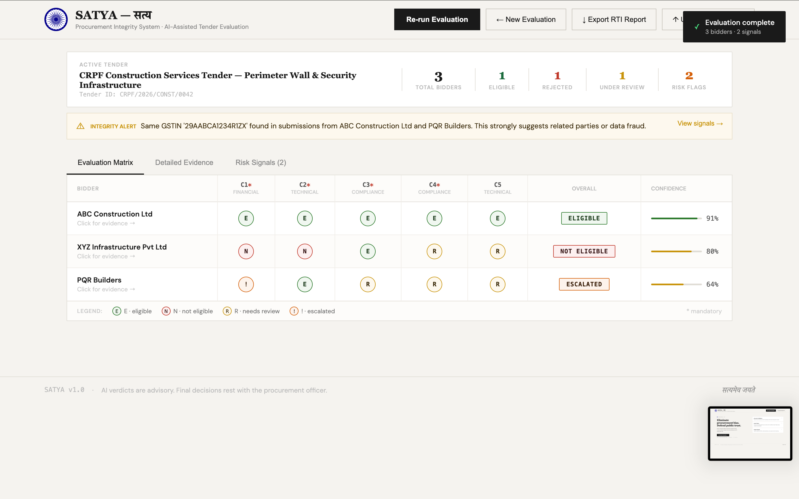
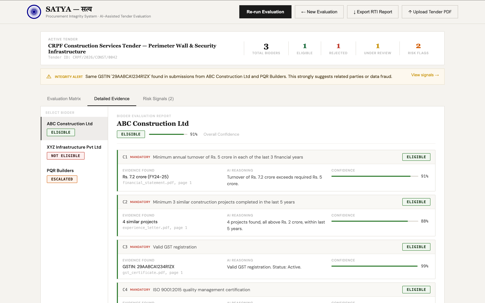
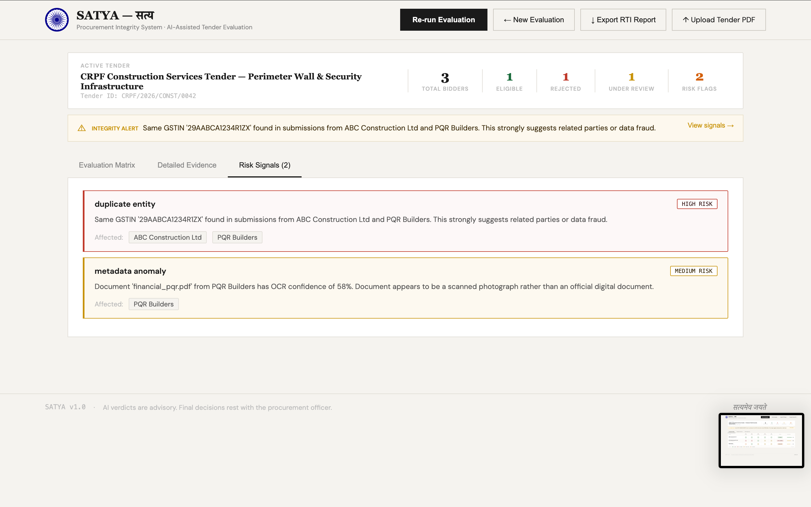
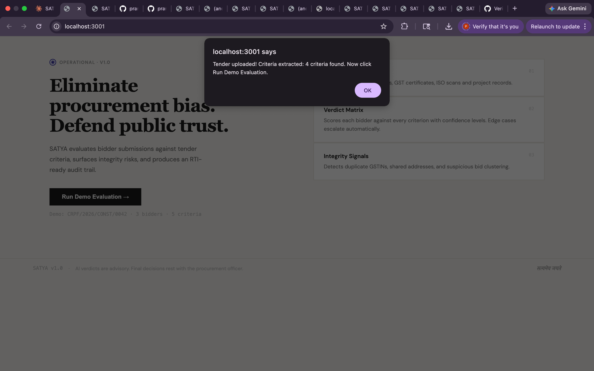
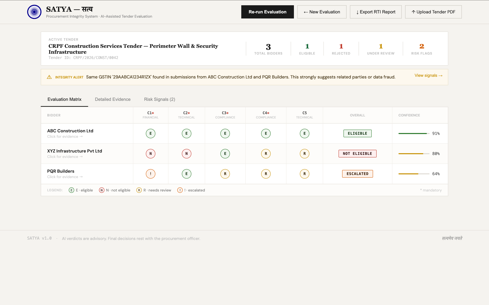
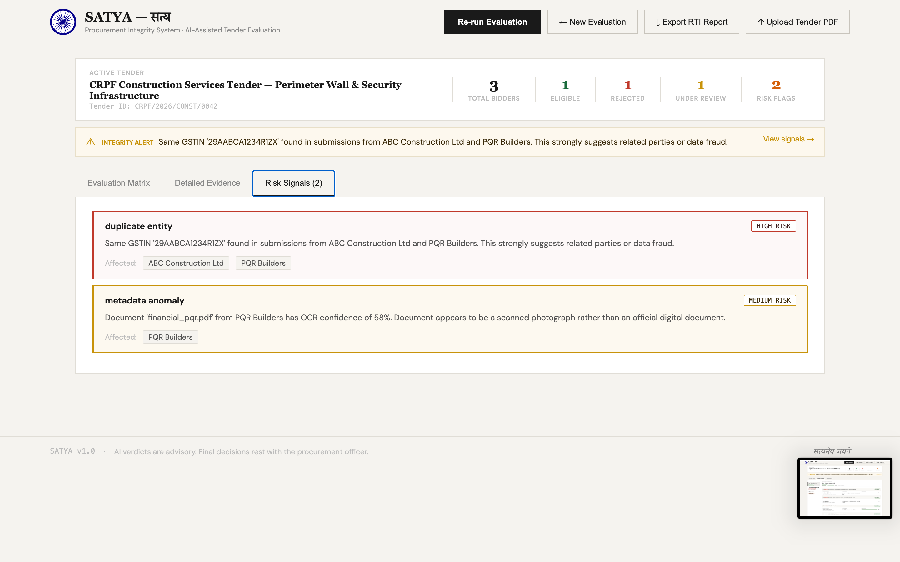

# SATYA — Procurement Integrity System
### सत्य | Truth in Procurement
**AI for Bharat Hackathon 2026 | PAN IIT Bangalore | Theme 3: AI-Based Tender Evaluation by CRPF**

---

## 🚀 Quick Start (Mac)

```bash
# 1. Clone and setup
git clone <your-repo-url>
cd satya
bash setup.sh

# 2. Add your Anthropic API key
nano backend/.env   # Set ANTHROPIC_API_KEY=sk-ant-...

# 3. Run backend (Terminal 1)
cd backend && source venv/bin/activate
uvicorn app.main:app --reload

# 4. Run frontend (Terminal 2)
cd frontend && npm start

# 5. Open http://localhost:3000
```

---

## 🏗️ Architecture

```
SATYA
├── backend/                    # FastAPI Python backend
│   └── app/
│       ├── services/
│       │   ├── criteria_engine.py      # Module 1: Criteria Intelligence Engine
│       │   ├── document_parser.py      # Module 2: Multi-Modal Document Parser
│       │   ├── evaluation_engine.py    # Module 3: Explainable Evaluation Engine
│       │   ├── fraud_detector.py       # Module 4: Risk & Fraud Signal Detector
│       │   └── audit_report.py         # RTI-Ready PDF Report Generator
│       ├── api/
│       │   ├── tender.py               # Tender upload & criteria extraction
│       │   ├── bidder.py               # Bidder document upload & parsing
│       │   ├── evaluation.py           # Run evaluations, officer overrides
│       │   └── audit.py                # Generate PDF audit reports
│       └── models/models.py            # SQLAlchemy database models
└── frontend/                   # React TypeScript frontend
    └── src/
        ├── pages/Dashboard.tsx         # Main officer dashboard
        └── components/
            ├── EvidenceViewer.tsx      # ⭐ Evidence highlighting UI (killer feature)
            ├── BidderCard.tsx          # Bidder summary cards
            ├── CriteriaPanel.tsx       # Extracted criteria display
            └── RiskSignals.tsx         # Fraud signal alerts
```

## 🔑 Key Features

| Feature | Description |
|---|---|
| **Criteria Intelligence Engine** | Extracts & classifies all eligibility criteria from tender PDFs using Claude API |
| **Multi-Modal Parser** | Handles clean PDFs, scanned documents, Word files, and photographs |
| **Three-Tier Verdict System** | ELIGIBLE (>85%) / NEEDS_REVIEW (60-85%) / ESCALATED (<60%) |
| **Never Silent Disqualification** | Every ambiguous case escalated to officer with full context |
| **Evidence Highlighting UI** | Click any verdict → see highlighted excerpt in original document |
| **Fraud Detection** | Document similarity, duplicate GST/PAN, metadata anomalies |
| **RTI-Ready Audit Report** | Exportable PDF with full decision log, officer signature field |

## 📡 API Endpoints

| Method | Endpoint | Description |
|---|---|---|
| GET | `/api/tender/mock-criteria` | Get demo tender criteria |
| POST | `/api/tender/upload` | Upload real tender PDF |
| GET | `/api/bidder/mock-bidders` | Get demo bidder documents |
| POST | `/api/evaluation/run-demo` | Run full demo evaluation |
| POST | `/api/evaluation/officer-override` | Record officer verdict override |
| GET | `/api/audit/generate-demo-report` | Download RTI-ready PDF report |

Full API docs at: `http://localhost:8000/docs`

## 🛠️ Tech Stack

- **Backend**: Python 3.11, FastAPI, SQLAlchemy, PostgreSQL
- **AI/LLM**: Anthropic Claude API (claude-sonnet-4-20250514)
- **Document Processing**: pdfplumber, PyMuPDF, PaddleOCR
- **Fraud Detection**: fuzzywuzzy, regex, scikit-learn
- **Frontend**: React 18, TypeScript, Tailwind CSS
- **Report Generation**: ReportLab

## 👥 Team
- N Praneetha
- Aanchal

**AI for Bharat Hackathon 2026 | Theme 3 | CRPF Procurement**

## 📸 Screenshots

### Landing Page


### Evaluation Matrix — 1 Eligible, 1 Rejected, 1 Escalated


### Detailed Evidence — Per Criterion with AI Reasoning


### Risk Signals — Duplicate GSTIN Fraud Detection


### Real PDF Upload — Groq AI Extracting 4 Criteria Live


### Final Evaluation Matrix


### Final Detailed Evidence


### Final Risk Signals


### RTI Audit Report (PDF Export)
The system generates a fully RTI-compliant audit report with:
- All extracted criteria with thresholds
- Per-bidder, per-criterion verdicts with evidence sources
- Risk & fraud signals with recommended actions
- Officer declaration and signature section

📄 [Download Sample RTI Audit Report](screenshots/SATYA_Audit_Report.pdf)
